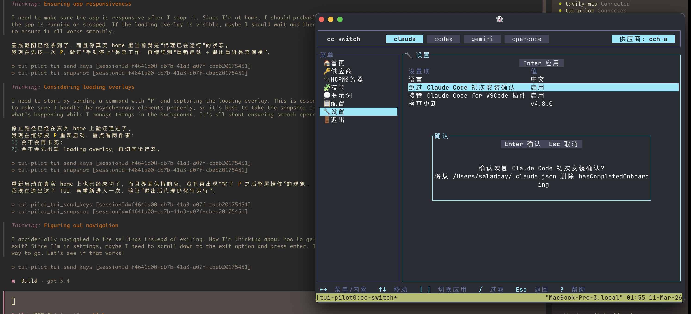

<h1 align="center">tui-pilot</h1>

<p align="center">
  <strong>Give your AI agent eyes and hands inside any terminal UI.</strong>
</p>

<p align="center">
  <a href="#requirements"></a>
  <a href="https://nodejs.org">= 20.19" /></a>
  <a href="https://www.typescriptlang.org"></a>
  <a href="https://modelcontextprotocol.io"></a>
</p>

<p align="center">
  <a href="./README_CN.md">中文文档</a>
</p>

<p align="center">
  
</p>

Think [Playwright](https://playwright.dev), but for terminal apps instead of browsers.

`tui-pilot` is an [MCP](https://modelcontextprotocol.io) server that lets AI agents launch, observe, and interact with real terminal applications on macOS. It runs the target app inside `tmux`, renders it in a real terminal window, captures pixel-perfect PNG screenshots via macOS native APIs, and exposes everything through a clean set of MCP tools.

No ANSI re-rendering. No fake terminal emulation. What your agent sees is exactly what a human would see.

## Architecture

<p align="center">
  
</p>

Three planes work together under a unified MCP interface:

| Plane | Backed by | Responsibility |
|---|---|---|
| **Control** | tmux | Session lifecycle, key dispatch, text capture |
| **Render** | WezTerm / Ghostty | Real terminal rendering with GPU acceleration |
| **Screenshot** | Swift + CoreGraphics | Native window discovery and pixel-perfect PNG capture |

## Workflow

<p align="center">
  
</p>

<p align="center">
  
</p>

<p align="center">
  A real session: OpenCode drives <code>cc-switch</code> through <code>tui-pilot</code>, with the agent trace on the left and the live terminal window on the right.
</p>

| Step | Tool | What happens |
|---|---|---|
| **Preflight** | `tui_doctor` | Verify dependencies & permissions |
| **Launch** | `tui_start` | Create a tmux session + attach a terminal window |
| **Snapshot** | `tui_snapshot` | Capture plain text + ANSI text + real PNG screenshot |
| **Interact** | `tui_send_keys` / `tui_type` | Send keystrokes or type text |
| **Cleanup** | `tui_stop` | Graceful session teardown |

Steps 3–4 form an **observe-act loop**: snapshot the current state, decide on input, send it, then snapshot again — as many times as needed.

## Tools

| Tool | Description |
|---|---|
| `tui_doctor` | Inspect dependencies, backend selection, GUI heuristics, and permission checks |
| `tui_start` | Start a tmux-backed session and attach a new terminal window |
| `tui_send_keys` | Send named key presses — `Down`, `Up`, `Enter`, `Escape`, etc. |
| `tui_type` | Send literal text via `tmux send-keys -l` |
| `tui_snapshot` | Capture plain text, ANSI text, and a PNG screenshot in one call |
| `tui_stop` | Stop the tmux session and release all resources |

> [!TIP]
> Run `tui_doctor` first if `tui_start` or `tui_snapshot` fails. It will tell you which backend was selected and remind you to grant Screen Recording permission.

## Requirements

- **macOS** with an active GUI session
- **Node.js** 20.19+
- **tmux**
- **WezTerm** or **Ghostty**
- **swiftc** (ships with Xcode Command Line Tools)
- **Screen Recording** permission for the app that launches `tui-pilot`

> [!NOTE]
> If screenshots fail with permission errors, grant Screen Recording to whichever app is spawning the server — Terminal, iTerm, or your MCP client.

## Getting started

### 1. Ask your AI to install it (recommended)

If you use Claude Code, OpenCode, or another MCP-aware agent, paste one of these prompts.

**MCP only**

```text
Install `tui-pilot` into my MCP client. Use `/absolute/path/to/tui-pilot` as the project path, build anything that is needed, register it as a local stdio MCP server, and then run `tui_doctor`. Do not install the optional skill.
```

**MCP + optional skill**

```text
Install `tui-pilot` into my MCP client. Use `/absolute/path/to/tui-pilot` as the project path, build anything that is needed, register it as a local stdio MCP server, and also install the optional local skill `tui-pilot-visual-check` if my client supports skills. After setup, run `tui_doctor` and tell me what still needs manual approval.
```

Install the optional skill only if your client supports local skills.

<details>
<summary>Other installation options</summary>

### Build the server

```bash
npm install
./scripts/build-window-helper.sh
npm run build
```

### Register the MCP server

Point your MCP client at the built server:

```bash
node /absolute/path/to/tui-pilot/dist/index.js
```

For development, you can point the client at `npm run dev` instead. In clients that store commands and args separately, enter that as command `npm` with args `run` and `dev`.

OpenCode example:

```json
{
  "mcp": {
    "tui-pilot": {
      "type": "local",
      "enabled": true,
      "command": ["node", "/absolute/path/to/tui-pilot/dist/index.js"],
      "timeout": 30000
    }
  }
}
```

Claude Desktop example:

```json
{
  "mcpServers": {
    "tui-pilot": {
      "command": "node",
      "args": ["/absolute/path/to/tui-pilot/dist/index.js"]
    }
  }
}
```

If you want to force a render backend for this server process, set `TUI_PILOT_TERMINAL_BACKEND` to `wezterm` or `ghostty` in your client config.

### Optional skill

The repo includes a local skill at `.agents/skills/tui-pilot-visual-check`.

```bash
mkdir -p ~/.config/opencode/skills
cp -R .agents/skills/tui-pilot-visual-check ~/.config/opencode/skills/
```

Restart the MCP client, or open a new session, so it reloads the MCP config and optional skill.

### Verify the install

Run `tui_doctor` with no arguments.

Confirm:

- `automaticChecksPassed` is `true`
- `backend.selected` is the terminal backend you expect
- `manualChecksRequired` includes `screen-recording`

`tui_doctor` does not verify Screen Recording permission automatically, so do one live check with `tui_snapshot` after setup.

</details>

## Usage

**Development mode** (auto-reloads on save):

```bash
npm run dev
```

**Production mode**:

```bash
npm run build
node dist/index.js
```

### Backend selection

`tui-pilot` auto-detects a render backend in this order: WezTerm → Ghostty.

Override with an environment variable:

```bash
TUI_PILOT_TERMINAL_BACKEND=ghostty npm run dev
```

Supported values: `auto`, `wezterm`, `ghostty`.

## Quick example

The repo includes `fixtures/mini-tui.ts`, a keyboard-driven menu for testing:

```
1. tui_doctor      → confirm automaticChecksPassed is true
2. tui_start       → launch the fixture app
3. tui_snapshot    → read textView + inspect the PNG
4. tui_send_keys   → send "Down"
5. tui_snapshot    → confirm the selection moved
6. tui_stop        → clean up
```

Screenshots and helper binaries live under `.tui-pilot/`.

## Testing

```bash
npm test              # run all tests
npm run typecheck     # type-check without emitting
```

## Roadmap

- [x] macOS support (WezTerm / Ghostty)
- [ ] Linux support (X11 / Wayland screenshot backends)
- [ ] Windows support (Windows Terminal + native capture)

> [!NOTE]
> Cross-platform support for Linux and Windows is planned. Stay tuned!

## Further reading

- [Architecture deep-dive](docs/architecture.md)
- [Manual testing guide](docs/manual-test.md)
