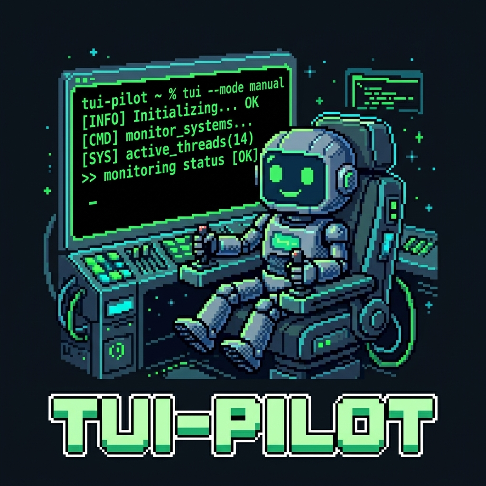
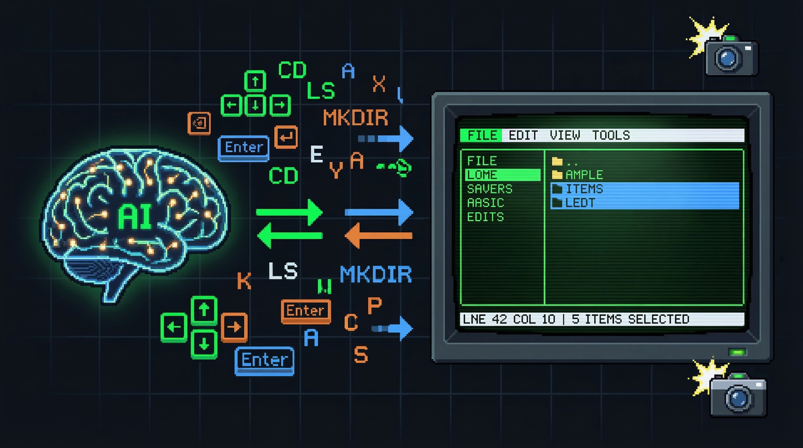
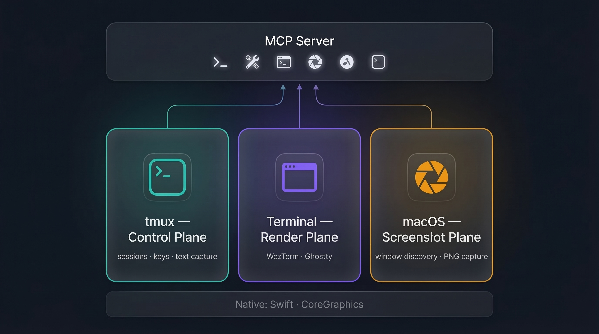
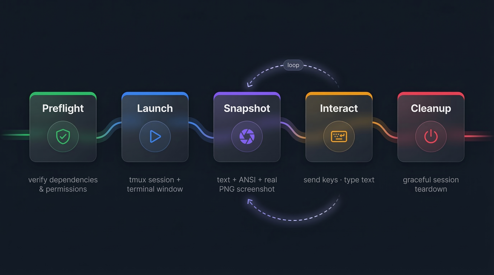

<p align="center">
  
</p>

<h1 align="center">tui-pilot</h1>

<p align="center">
  An MCP server that drives terminal UIs through a real macOS terminal window.
</p>

<p align="center">
  
</p>

It starts the target app inside `tmux`, opens a detached terminal window for real rendering, captures a real PNG with macOS `screencapture`, and returns text plus the local PNG file path through MCP tools.

## Current scope

- macOS only
- keyboard interaction only
- one in-memory session store per server process
- real screenshots, not ANSI re-rendering

## Architecture

<p align="center">
  
</p>

The server exposes 6 MCP tools. Under the hood it coordinates three planes:

- **tmux — Control Plane**: session lifecycle, key dispatch, text capture
- **Terminal — Render Plane**: WezTerm or Ghostty renders the actual TUI
- **macOS — Screenshot Plane**: native window discovery and PNG capture via Swift / CoreGraphics

## Workflow

<p align="center">
  
</p>

1. **Preflight** — verify dependencies & permissions (`tui_doctor`)
2. **Launch** — create a tmux session and attach a terminal window (`tui_start`)
3. **Snapshot** — capture text + ANSI + real PNG screenshot (`tui_snapshot`)
4. **Interact** — send keys or type text (`tui_send_keys` / `tui_type`)
5. **Cleanup** — graceful session teardown (`tui_stop`)

Steps 3 and 4 form an observe-act loop: snapshot the current state, decide on input, send it, then snapshot again.

## Requirements

- Node.js 20.19 or newer
- `tmux`
- `wezterm` or `ghostty`
- `swiftc`
- macOS with an active GUI session
- Screen Recording permission for the app that launches `tui-pilot`

If screenshots fail with permission errors, grant Screen Recording to whichever app is spawning the server process. That may be Terminal, iTerm, or a desktop MCP client.

## Install

```bash
npm install
./scripts/build-window-helper.sh
```

## Build and test

```bash
npm run build
npm run typecheck
npm test
```

## Run the MCP server locally

For local development:

```bash
npm run dev
```

For a compiled build:

```bash
npm run build
node dist/index.js
```

The server uses stdio transport. In normal use, let your MCP client spawn `npm run dev` or `node dist/index.js` as the server command instead of trying to connect to a long-running socket endpoint.

## Backend selection

`tui-pilot` auto-detects a supported render backend in this order:

1. WezTerm
2. Ghostty

You can override the selection with:

```bash
TUI_PILOT_TERMINAL_BACKEND=ghostty npm run dev
```

Supported values are `auto`, `wezterm`, and `ghostty`.

## Tools

| Tool | Description |
|---|---|
| `tui_doctor` | inspect dependencies, backend selection, GUI heuristics, and manual permission checks |
| `tui_start` | start a tmux-backed session and attach a new terminal window |
| `tui_send_keys` | send named key presses such as `Down`, `Up`, `Enter` |
| `tui_type` | send literal text with `tmux send-keys -l` |
| `tui_snapshot` | capture plain text, ANSI text, and a PNG screenshot |
| `tui_stop` | stop the tmux session and forget it from the in-memory store |

Run `tui_doctor` first if `tui_start` or `tui_snapshot` fails. It cannot verify Screen Recording permission automatically, but it will tell you which backend was selected and remind you to grant permission to the app that launched the server.

## Example fixture flow

The repo includes `fixtures/mini-tui.ts`, a small keyboard-driven menu used by the integration test.

Typical MCP flow:

1. Call `tui_doctor` and confirm `automaticChecksPassed` is `true`.
2. Call `tui_start` with `cwd`, `command`, `cols`, and `rows`.
3. Call `tui_snapshot` and inspect `textView` plus the local PNG path in `visual.imageArtifactId`.
4. Call `tui_send_keys` with `Down`.
5. Call `tui_snapshot` again and confirm the selection moved.
6. Call `tui_stop` when done.

Screenshots and helper binaries are written under `.tui-pilot/`.

## More docs

- [Architecture](docs/architecture.md)
- [Manual Testing](docs/manual-test.md)
